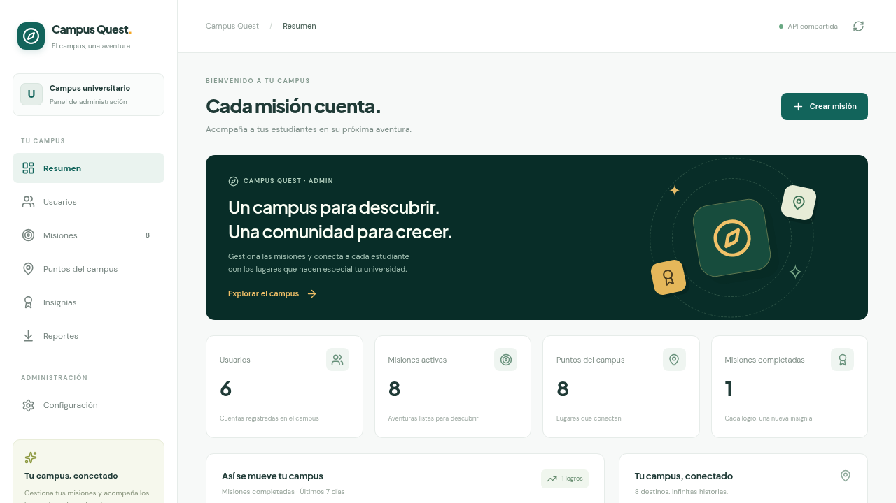
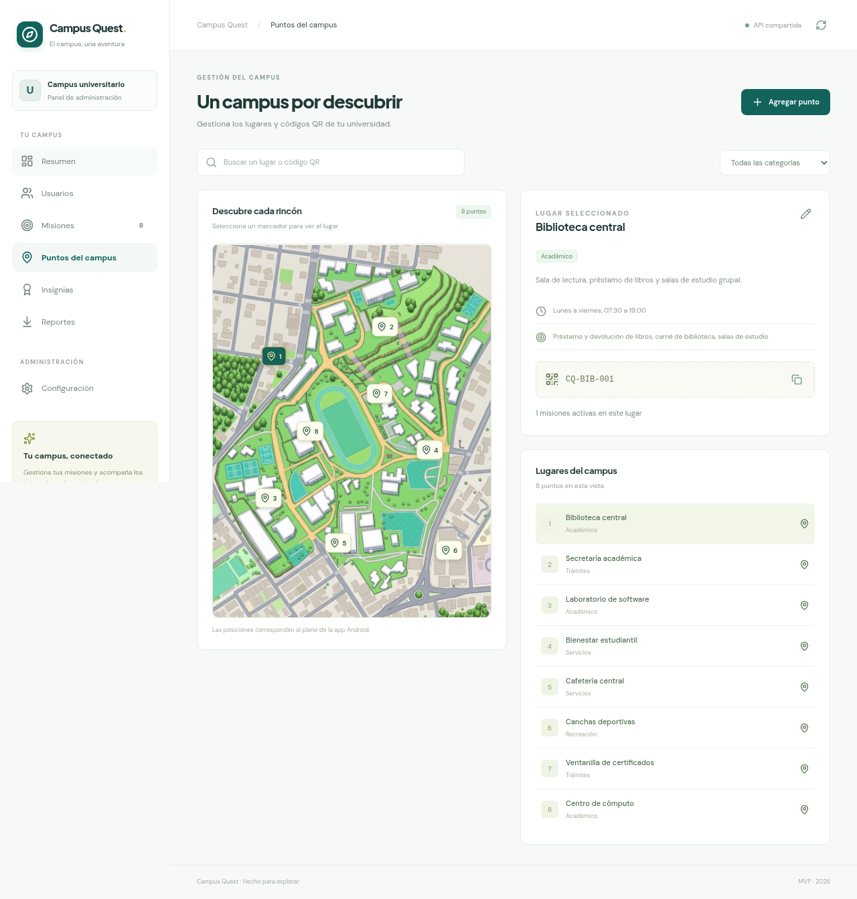
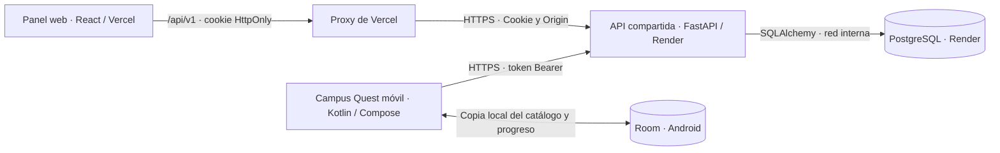

# Campus Quest · Panel web y API

**El campus, una aventura.** Campus Quest conecta la exploración de la
universidad con misiones, códigos QR, puntos e insignias. La aplicación móvil
Android acompaña al estudiante; este repositorio contiene el panel web para
gestionar el campus y la API que comparten ambos clientes.



*Panel publicado en Vercel y conectado a la API de Render. Captura con datos
de prueba, tomada el 4 de octubre de 2026.*

<details>
<summary>Ver el mapa y los puntos del campus</summary>



El mapa y los lugares son los mismos que utiliza la aplicación Android.

</details>

| Componente | Qué hace | Tecnología |
|---|---|---|
| Aplicación móvil Campus Quest | Explorar el mapa, consultar misiones, validar QR y ver logros | Kotlin, Jetpack Compose y Room |
| Panel web | Administrar lugares, misiones, usuarios e informes | React, Vite y Tailwind CSS |
| API compartida | Autenticar, validar el progreso y calcular puntos | FastAPI y SQLAlchemy |
| Base online | Conservar cuentas, catálogo, sesiones y completaciones | PostgreSQL en Render |

### Abrir el proyecto publicado

- [Panel web](https://campus-quest-admin.vercel.app)
- [Documentación interactiva de la API](https://campus-quest-api-prod.onrender.com/docs)
- [Estado de la API](https://campus-quest-api-prod.onrender.com/api/v1/health)

El panel requiere una cuenta con permisos de administración. En Android se
puede entrar con una cuenta institucional o crear una sesión de visitante.

## Cómo se conectan la web y Android



**Desde la web:** el navegador consulta `/api/v1` en el dominio de Vercel.
La función `frontend/api/proxy.js` reenvía la petición a Render y conserva la
cookie de sesión. React muestra los datos que devuelve la API.

**Desde Android:** `CampusApi` consulta directamente
`https://campus-quest-api-prod.onrender.com/api/v1/`. El token de sesión viaja
como Bearer y se guarda cifrado mediante Android Keystore. El repositorio
remoto actualiza Room al abrir la app y cada 30 segundos mientras está visible.
Las pantallas leen esa copia local del catálogo y del progreso.

**Una base compartida:** los cambios del panel se guardan en PostgreSQL y llegan
al móvil en su siguiente actualización. Una misión completada en Android
aparece en el panel al actualizar sus datos. Los clientes se comunican con
FastAPI; solo el backend accede a PostgreSQL.

### De un QR a una insignia

1. El estudiante elige una misión y escanea el QR del lugar, o introduce el
   código manualmente desde Android.
2. La app envía el ID de la misión y el código a
   `POST /api/v1/usuarios/{id}/progreso`.
3. El backend comprueba la sesión, el usuario, el QR y que la misión esté activa.
4. En una transacción guarda la completación y calcula puntos, fecha y nivel.
   Repetir la misma completación no vuelve a sumar puntos.
5. Android actualiza la copia local y muestra la insignia. El panel puede
   consultar ese mismo evento para sus estadísticas e informes.

Consulta [la arquitectura completa](docs/ARCHITECTURE.md),
[el contrato HTTP](docs/API.md) y [la integración móvil](docs/ANDROID.md).

## Qué funciona

- Resumen calculado desde usuarios y progreso, ranking y actividad semanal.
- Búsqueda y filtros de usuarios, consulta de perfiles e historial de insignias.
- Crear, editar, archivar y reactivar misiones. Archivar conserva el historial.
- Crear y editar puntos del campus, coordenadas en el mapa y códigos QR únicos.
- Reportes por periodo y exportación CSV de usuarios y completaciones.
- Login administrativo real, sesión HttpOnly y permisos verificados en servidor.
- API de progreso: valida el QR, registra la misión y otorga puntos una sola vez,
  incluso con solicitudes simultáneas o reintentos.
- PostgreSQL online compartido por web y Android; SQLite para desarrollo local.
- Vista de demostración independiente, con registros ficticios **en memoria**.

La integración móvil ya está implementada en la rama
`prueba/integracion-backend-web-android` del proyecto Android. Se comprobó una
completación desde el emulador contra Render y su consulta desde el proxy web.
El catálogo inicial contiene ocho lugares y ocho misiones del campus.

### Perfiles y alcance

| Perfil | Acceso |
|---|---|
| Estudiante | Catálogo, ranking y su propio progreso desde Android |
| Visitante | Exploración y progreso mediante una sesión temporal |
| Profesor o gestor con rol `admin` | Panel web, edición del catálogo y consulta administrativa |

El registro público crea estudiantes; los permisos de administración se
asignan de forma explícita. Una etiqueta de profesor o el antiguo rol `tutor`
no conceden acceso administrativo por sí solos.

Room permite consultar la última descarga sin conexión. Completar misiones
requiere internet; todavía no hay una cola de envíos pendientes. Las cuentas
y el progreso de la antigua base local del teléfono se conservan separados y
no se importan automáticamente. La verificación de correo, recuperación de
cuenta, cursos y premios canjeables quedan fuera de esta versión.

## Estructura

```text
campus-quest-admin/
├── frontend/
│   ├── src/pages/             # Resumen, perfiles, misiones, mapa e informes
│   ├── src/services/          # Adaptadores FastAPI y demo
│   ├── src/data/              # Catálogo Android y usuarios ficticios
│   ├── public/                # Mapa, fuente de marca y tarjeta social
│   ├── tests/                 # Contrato HTTP, demo y exportación
│   ├── api/proxy.js          # Proxy Vercel → FastAPI
│   ├── vercel.json
│   ├── .env.example
│   └── package.json
├── backend/
│   ├── app.py                # API, autorización y frontend compilado
│   ├── models.py             # Tablas SQLAlchemy
│   ├── schemas.py            # Validación de entradas y JSON público
│   ├── security.py           # Contraseñas, sesiones y permisos
│   ├── config.py
│   ├── cli.py                # Inicialización y creación de administrador
│   └── catalog.json          # Catálogo original Android
├── tests/                    # Integración real de API y concurrencia
├── docs/                     # Arquitectura, contrato, deploy y Android
├── deploy/Caddyfile          # HTTPS automático para producción
├── Dockerfile.backend        # Solo FastAPI para Railway
├── Dockerfile                # Web + API para Docker local
├── compose.yaml
├── requirements.txt
└── .env.example
```

## 1. Probar solo el dashboard

Requiere Node **22.13 o superior**; se recomienda Node 24 LTS.

```bash
cd frontend
npm ci
VITE_DATA_MODE=demo npm run dev
```

Abre la dirección que Vite indique, normalmente <http://localhost:5173>.
El comando anterior activa el modo demo. Puedes explorar perfiles, crear misiones,
archivarlas y cambiar lugares. **Recargar la página restablece la demo**. El modo predeterminado del panel es API.
No se necesita contraseña ni servidor Python para esta vista.

## 2. Ejecutar frontend + backend real

Requiere Python **3.13 o superior**. Todos los comandos Python se ejecutan desde
la raíz del repositorio.

```bash
python3 -m venv .venv
source .venv/bin/activate
pip install -r requirements-dev.txt
cp .env.example .env
set -a
source .env
set +a
python -m backend.cli init
python -m backend.cli create-admin --email admin@tu-universidad.edu
```

`create-admin` solicita una contraseña de 8 a 256 caracteres, que se guarda
como hash. No hay credenciales administrativas predeterminadas. `init` crea
las tablas y carga el catálogo de Android; no crea alumnos ni un admin.

Opcional, solo para probar perfiles e informes con datos ficticios:

```bash
python -m backend.cli seed-demo
```

Inicia la API en la primera terminal:

```bash
uvicorn backend.app:app --reload --host 0.0.0.0 --port 8000
```

En otra terminal, desde la raíz:

```bash
cp frontend/.env.example frontend/.env
npm --prefix frontend ci
npm --prefix frontend run dev
```

Abre <http://localhost:5173> e inicia sesión con el administrador que creaste.
Ahora los cambios se guardan en SQLite. Vite reenvía `/api` a FastAPI:
**no tienes que introducir una URL diferente en cada petición**.

- Salud: <http://localhost:8000/api/v1/health>
- API interactiva: <http://localhost:8000/docs>
- Contrato OpenAPI: <http://localhost:8000/openapi.json>

Si quieres volver a la vista demo, cambia `VITE_DATA_MODE=demo` en
`frontend/.env` y reinicia Vite. Un fallo del servidor en modo API muestra el
error; nunca cambia silenciosamente a registros ficticios.

## 3. Ejecutar la versión compilada

Con el entorno Python activado y las variables `.env` cargadas:

```bash
VITE_DATA_MODE=api npm --prefix frontend run build
uvicorn backend.app:app --host 0.0.0.0 --port 8000
```

Abre <http://localhost:8000>. FastAPI sirve el dashboard y `/api/v1` en el mismo
origen. Esto reproduce la arquitectura de despliegue. `vite preview` sirve
solo para revisión local y no es el servidor de producción.

## 4. Render + Vercel: MVP gratuito

Sigue [la guía completa de despliegue](docs/DEPLOY.md#render--vercel-mvp-gratuito).

- **Render**: Web Service desde la raíz, runtime **Python 3** explícito,
  `PYTHON_VERSION=3.13.16`, build `pip install -r requirements.txt` y start
  `uvicorn backend.app:app --host 0.0.0.0 --port $PORT --workers 1`.
- **PostgreSQL Render**: URL interna secreta solo en backend,
  `APP_ENV=production`, `COOKIE_SECURE=true` y `ALLOWED_ORIGINS` con el origen
  HTTPS exacto de Vercel. Inicializa catálogo/admin desde tu equipo mediante
  la URL externa con SSL: el plan Free carece de SSH y pre-deploy.
- **Vercel**: Root Directory `frontend`, framework Vite, build `npm run build`,
  salida `dist`, Node 24 y Fluid Compute activo para el proxy de hasta 120 s.
- **Variables Vercel**: `VITE_DATA_MODE=api`, `VITE_API_BASE_URL=/api/v1`,
  `BACKEND_URL=https://tu-backend.onrender.com` y
  `VITE_API_DOCS_URL=https://tu-backend.onrender.com/docs`.

El proxy incluido reenvía las cookies y el Origin del navegador. No necesitas
cambiar a cookies entre dominios ni exponer una credencial del backend en React.
Las URLs anteriores son ejemplos. Render Free pausa la API tras 15 minutos
sin tráfico y su PostgreSQL gratuito expira a los 30 días; sirve para revisar
el MVP. Antes de guardar datos de uso continuo, programa una migración o cambia
el plan de la base de datos. [Límites oficiales de Render](https://render.com/docs/free).

La [alternativa Railway + Vercel](docs/DEPLOY.md#railway--vercel-alternativa)
usa `Dockerfile.backend` y PostgreSQL, conservando el mismo contrato y proxy.

## 5. Docker: todo en un servicio

Necesitas Docker Engine en ejecución y Docker Compose.

```bash
cp .env.example .env
docker compose up -d --build
docker compose exec app python -m backend.cli init
docker compose exec app python -m backend.cli create-admin --email admin@tu-universidad.edu
```

Abre <http://localhost:8000>. El frontend se compila automáticamente en modo
API durante la construcción de la imagen. SQLite vive en el volumen
`campus_data`; reiniciar o reconstruir el contenedor conserva los datos.

Opcional para pruebas:

```bash
docker compose exec app python -m backend.cli seed-demo
```

Este comando carga registros ficticios; omítelo en tu despliegue real.
Consulta los pasos de dominio, HTTPS, PostgreSQL, copias de seguridad y
actualizaciones en [docs/DEPLOY.md](docs/DEPLOY.md).

## Configuración

| Variable | Dónde | Uso |
|---|---|---|
| `DATABASE_URL` | Backend | SQLite o `postgresql+psycopg://...` |
| `PYTHON_VERSION` | Render, runtime nativo | `3.13.16`, versión fijada para el MVP |
| `APP_ENV` | Backend | `development` o `production` |
| `COOKIE_SECURE` | Backend | `false` en HTTP local; `true` con HTTPS |
| `ALLOWED_ORIGINS` | Backend | Orígenes autorizados, separados por comas |
| `SESSION_TTL_HOURS` | Backend | Duración de la sesión, 24 horas por defecto |
| `FRONTEND_DIST_DIR` | Backend | Carpeta compilada que FastAPI sirve |
| `VITE_DATA_MODE` | Frontend, al compilar | `api` o `demo` |
| `VITE_API_BASE_URL` | Frontend, al compilar | `/api/v1` para el mismo origen |
| `API_PROXY_TARGET` | Vite, desarrollo | Servidor al que reenvía `/api` |
| `BACKEND_URL` | Función Vercel | Origen HTTPS del backend, sin `/api/v1` |
| `VITE_API_DOCS_URL` | Frontend | Enlace público a Swagger del backend |
| `VITE_SITE_ORIGIN` | Frontend, al compilar | Origen HTTPS de la tarjeta social |
| `DOMAIN` | Compose, perfil producción | Dominio público de Caddy |
| `SITE_ORIGIN` | Compose, al compilar | Se pasa a `VITE_SITE_ORIGIN` |

Los archivos `.env`, las bases SQLite y `.venv/` se excluyen de Git. Nunca
introduzcas contraseñas, claves privadas o credenciales de BD en `VITE_*`:
esas variables forman parte del JavaScript público del navegador.

## Documentación y verificación

- [Arquitectura y decisiones](docs/ARCHITECTURE.md)
- [Contrato API y ejemplos](docs/API.md)
- [Despliegue y mantenimiento](docs/DEPLOY.md)
- [Aplicación móvil e integración Android](docs/ANDROID.md)
- [Verificación realizada y pendientes](docs/VALIDATION.md)

```bash
.venv/bin/python -m pytest tests -q
npm --prefix frontend test
npm --prefix frontend run build
```

Las pruebas del servidor cubren sesiones, permisos, privacidad, QR únicos,
archivo, historial y completaciones concurrentes. Las del frontend verifican
su adaptador HTTP y que los errores remotos no se sustituyan por datos demo.
La conexión de Android, PostgreSQL y el proxy HTTPS de producción se comprobó
en la rama de integración; los resultados están en [VALIDATION.md](docs/VALIDATION.md).
