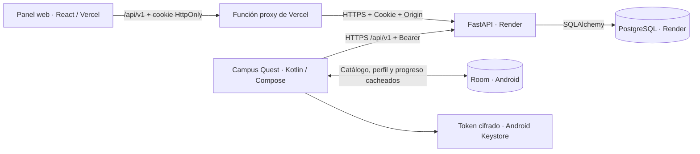
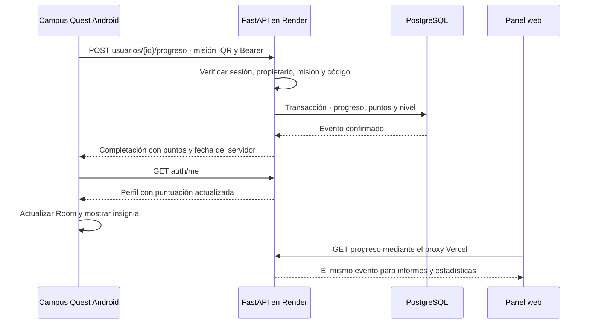

# Arquitectura de Campus Quest

## Un backend para la aplicación móvil y el panel web

Campus Quest tiene dos clientes: una aplicación Android para explorar el
campus y un panel web para administrar su catálogo. FastAPI aplica las reglas
de acceso y progreso; PostgreSQL en Render conserva los datos compartidos.

La integración Android está implementada en la rama de pruebas
`prueba/integracion-backend-web-android`. El backend de esa rama se publicó
en Render y se verificó una completación móvil desde el panel web. La rama
`main` todavía conserva la versión anterior; publicar esa versión puede
reemplazar los endpoints móviles. Véase [VALIDATION.md](VALIDATION.md).

## Conexión del panel web

React crea el cliente en `frontend/src/services/campus.js`. En modo API,
consulta `/api/v1` con `credentials: include`. Vercel sirve los archivos de
React y reescribe estas rutas hacia `frontend/api/proxy.js`.

El proxy construye la URL con el origen configurado en `BACKEND_URL`, conserva
Cookie y Origin, y devuelve Set-Cookie al navegador. La sesión queda en el
dominio web con HttpOnly, Secure y SameSite=Lax. La API limita las operaciones
según el rol de la cuenta y comprueba Origin en las mutaciones con cookie.

El panel descarga usuarios, puntos, misiones y progreso para calcular resumen,
ranking e informes. Tras editar el catálogo vuelve a consultar la API. La
página abierta se actualiza mediante su botón de recarga; no usa WebSockets.

En desarrollo, Vite reenvía `/api` a FastAPI en el puerto 8000. Docker permite
servir React compilado y la API juntos desde FastAPI; Caddy puede terminar HTTPS.
SQLite se utiliza para desarrollo local, PostgreSQL para la instancia online.

## Conexión de la aplicación Android

En el proyecto móvil, `AppContainer` inyecta `CampusApi`, `SessionTokenStore` y
`RemoteCampusRepository`. La URL base se define en `app/build.gradle.kts`:
`https://campus-quest-api-prod.onrender.com/api/v1/`.

`CampusApi` envía las peticiones HTTPS fuera del hilo principal. Tras login,
registro o creación de visitante recibe un token Bearer, que `SessionTokenStore`
cifra con AES/GCM y una clave de Android Keystore. Room conserva el perfil
público, sin hashes de contraseña.

El repositorio remoto consulta perfil, puntos, catálogo personal, progreso y
ranking. Guarda el perfil, catálogo y progreso en `campus_quest_remote.db`,
con una transacción Room. El ranking se conserva en memoria. Las pantallas
observan los Flow de Room para actualizarse sin cambiar su lógica de presentación.
La sincronización se ejecuta al iniciar sesión, al abrir la app y cada 30
segundos mientras está visible. No existe una conexión persistente en tiempo real.

Una respuesta 401 elimina el token y devuelve al login. Logout elimina el
secreto local e intenta revocar la sesión remota; si falla la red, el servidor
puede conservarla hasta que expire. La sesión dura 24 horas por defecto.
El visitante no recupera una cuenta anterior escribiendo el mismo nombre.

La copia local puede leerse sin internet. Validar una misión exige conexión;
esta versión no acumula completaciones pendientes para enviarlas después.
La antigua `campus_quest.db` se mantiene separada para evitar confundir IDs
locales con cuentas del servidor. No se migran automáticamente sus usuarios,
hashes, sesiones ni puntos.

## Validación de una misión

Una repetición válida devuelve el evento existente. El servidor decide la
recompensa y la fecha; no confía en totales calculados por el teléfono.
`GET /catalogo` incluye las misiones activas y las archivadas que el usuario
ya completó, para reconstruir sus insignias e historial.

## Datos compartidos

| Entidad | Función | Campos públicos principales |
|---|---|---|
| Usuario | Perfil, puntuación y permisos | `nombres`, `correoInstitucional`, `carrera`, `puntajeAcumulado`, `nivel`, `rol` |
| PuntoInteres | Lugar del campus y QR | `categoria`, `codigoQr`, `posX`, `posY`, horarios y trámites |
| Mision | Reto y su insignia | `puntoInteresId`, `puntos`, `tiempoEstimadoMin`, `dificultad`, `activa` |
| ProgresoMision | Evento confirmado | `usuarioId`, `misionId`, `fechaHora`, `puntosObtenidos`, `codigoQrValidado` |
| Sesion | Autenticación remota | Hash del token, usuario y expiración; sin exposición pública |

Los campos conservan el camelCase español del modelo Android. `fechaHora` es
Unix epoch en milisegundos. `posX` y `posY` están entre 0 y 1 y representan
posiciones relativas en el plano, no coordenadas GPS.

El catálogo inicial deriva del `SeedData.kt` móvil. La vista demo mantiene una
copia independiente y datos ficticios en memoria; el modo API muestra los datos
reales del servidor y no recurre a la demo si ocurre un error de conexión.

## Roles y sesiones

- `admin`: acceso al panel, gestión de catálogo y consulta administrativa. Un
  profesor o gestor necesita este rol para administrar desde la web.
- `estudiante` y `visitante`: catálogo, ranking y su propio progreso.
- `tutor`: rol legado local; no concede permisos administrativos remotos.

El registro institucional crea únicamente estudiantes. El acceso visitante
crea una cuenta distinta y una sesión temporal. Ninguna de esas rutas permite
solicitar un rol administrativo. El correo institucional se valida por formato;
esta versión no verifica su propiedad ni ofrece recuperación de contraseña.

El backend guarda las contraseñas como PBKDF2 SHA256 con salt aleatorio y
600 000 iteraciones. Las sesiones usan tokens aleatorios y la base conserva
su hash SHA256. El navegador usa cookie HttpOnly; Android usa Bearer. La
expiración y el rol se comprueban en el servidor para cada operación.

CORS limita los orígenes web configurados y no sustituye la autenticación.
La aplicación Android no se conecta al proxy Vercel ni directamente a PostgreSQL.
El ranking remoto expone nombres, IDs, puntos y niveles; no incluye correos.

## Reglas de consistencia

1. El QR se normaliza con `trim` y mayúsculas y es único por punto.
2. La restricción UNIQUE sobre `(usuarioId, misionId)` impide recompensas duplicadas.
3. Validar QR, insertar progreso y actualizar puntuación se hace en una
   transacción. SQLite serializa escrituras y PostgreSQL bloquea las filas.
4. `nivel = 1 + floor(puntajeAcumulado / 100)`.
5. Archivar marca `activa=false`, conserva el historial y bloquea nuevas
   completaciones. Los reintentos de eventos ya confirmados son idempotentes.
6. Editar los puntos de una misión no altera recompensas anteriores.
7. Una misión con progreso no cambia de lugar; un punto con misiones no se borra.
8. Los hashes de contraseña y tokens de otras sesiones no se exponen en perfiles.

## Límites y evolución

La estructura inicial usa `create_all`, sin migraciones versionadas de esquema.
Antes de cambiar tablas con datos reales se debe incorporar Alembic y un plan
de migración. Cambiar `DATABASE_URL` selecciona otra base; no copia sus registros.

Las colecciones administrativas se descargan completas; el ranking móvil se
limita a 100 participantes. Para crecer hacen falta paginación y agregados en
el servidor. La sesión no tiene renovación automática. Quedan pendientes la
verificación de correo, recuperación de cuenta, migración de datos locales y
una cola de completaciones sin conexión.

La operación continua necesita un plan de conservación de PostgreSQL, copias
de seguridad, auditoría de cambios y límites de autenticación. Consulta las
condiciones del despliegue actual en [DEPLOY.md](DEPLOY.md).
