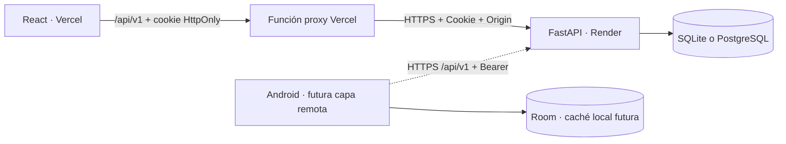

# Arquitectura del MVP

## Un servidor, dos clientes

Actualmente solo el dashboard en modo API consume FastAPI. Android continúa
leyendo y escribiendo exclusivamente en Room. La flecha Android → API es el
trabajo de la próxima etapa, no una sincronización ya implementada.

En desarrollo, Vite sirve React en el puerto 5173 y reenvía `/api` a FastAPI
en 8000. En el despliegue previsto, Vercel sirve React y su función `api/proxy.js`
reenvía `/api/v1` a Render. La cookie se guarda en el dominio web Vercel;
el proxy conserva Origin para la comprobación del backend. Android podrá
consumir Render directamente con Bearer. Como alternativa, Docker sirve
todo junto con FastAPI y Caddy puede terminar HTTPS.

## Modelos conservados de Android

| Entidad | Función | Campos importantes |
|---|---|---|
| Usuario | Perfil y permisos | `nombres`, `correoInstitucional`, `carrera`, `puntajeAcumulado`, `nivel`, `rol` |
| PuntoInteres | Lugar del plano | `categoria`, `codigoQr`, `posX`, `posY`, horarios y trámites |
| Mision | Reto y su insignia | `puntoInteresId`, `puntos`, `tiempoEstimadoMin`, `dificultad`, `activa` |
| ProgresoMision | Evento completado | `usuarioId`, `misionId`, `fechaHora`, `puntosObtenidos`, `codigoQrValidado` |
| Sesion | Autenticación remota nueva | Hash del token, usuario y expiración |

Los campos públicos conservan los nombres camelCase españoles de Android.
`fechaHora` es Unix epoch en milisegundos; `posX` y `posY` están entre 0 y 1 y
representan posiciones relativas en el plano, no coordenadas GPS.

El catálogo del backend y el del frontend demo derivan del mismo `SeedData.kt`
original. Son copias para que la vista demo y el backend puedan ejecutarse por
separado. **En modo API, la base de datos del servidor es la fuente de verdad**;
el frontend nunca mezcla ese catálogo demo con respuestas reales.

## Roles y sesiones

- `admin`: lectura administrativa, misiones, puntos y progreso.
- `estudiante` / `visitante`: consulta del catálogo y de su propio progreso.
- `tutor`: rol legado del Android actual; no tiene privilegios administrativos
  por ese nombre. Debe migrarse de forma explícita en la próxima etapa.

Los administradores se crean por CLI; no hay una ruta pública que conceda ese
rol. El backend verifica el rol en cada operación. Ocultar un botón no concede
ni revoca permisos.

Las contraseñas nuevas usan PBKDF2 SHA256, salt aleatorio y 600 000 iteraciones.
La sesión usa un token aleatorio de alta entropía; en BD se guarda únicamente
su SHA256. El mismo token puede viajar en cookie HttpOnly desde la web o en
`Authorization: Bearer ...` desde Android. El navegador no guarda el token en
localStorage. Logout revoca la sesión en BD y elimina la cookie; la expiración
se comprueba en el servidor.

Las mutaciones autenticadas con cookie exigen un `Origin` autorizado. Las
peticiones Android con Bearer no dependen de Origin. CORS permite únicamente
los orígenes configurados; no sustituye la autenticación.

## Reglas que no deben romperse

1. El QR se normaliza con `trim` y mayúsculas y es único por punto.
2. Una misión solo puede completarse una vez por usuario: existe una restricción
   UNIQUE real de BD sobre `(usuarioId, misionId)`.
3. Validar QR, insertar progreso y actualizar puntaje/nivel se hace en una
   transacción. SQLite serializa escrituras; PostgreSQL bloquea las filas.
4. El cliente envía misión y QR. El servidor decide puntos y fecha; no acepta
   un puntaje arbitrario enviado por el móvil.
5. `nivel = 1 + floor(puntajeAcumulado / 100)`.
6. Archivar marca `activa=false`, conserva misión, punto e historial y bloquea
   nuevas completaciones. Un reintento correcto de una completación anterior
   devuelve el mismo evento, incluso después del archivo.
7. Editar puntos de una misión no altera recompensas ya registradas.
8. Una misión con progreso no cambia de punto. Un punto con misiones no se borra.
9. Hashes de contraseña y tokens de otras sesiones nunca se exponen en perfiles.

## Límites de esta entrega

Se creó la estructura inicial con `create_all`. No se implementaron migraciones
versionadas del esquema: antes de cambiar tablas con datos reales se deben
incorporar Alembic y un plan de migración. Cambiar `DATABASE_URL` selecciona
otra BD; no transporta los registros existentes.

Las colecciones administrativas se descargan completas, apropiado para este
MVP. Antes de crecer, añadir paginación y agregados en servidor. La sesión
expira sin un mecanismo de refresh; el administrador vuelve a iniciar sesión.
Registro institucional, verificación de correo, recuperación de contraseña,
creación de visitantes, migración de cuentas Room y sincronización offline
quedan pendientes.

Para un servicio expuesto a muchos usuarios, incorporar límites de login,
auditoría de cambios y observabilidad. PostgreSQL está soportado por la
configuración, pero requiere pruebas en una instancia real de destino.
