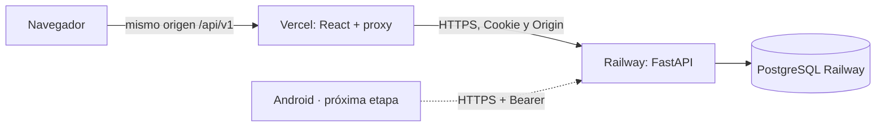

# Despliegue y mantenimiento

## Railway + Vercel

Este es el despliegue previsto para el proyecto. El repositorio contiene dos
servicios: Railway ejecuta FastAPI y Vercel compila `frontend/` con Vite.



### 1. Preparar Railway

1. Crea un proyecto Railway y agrega PostgreSQL.
2. Agrega un servicio desde este repositorio GitHub. Mantén **Root Directory
   en la raíz**, porque `requirements.txt` y `Dockerfile.backend` están allí.
3. Configura `RAILWAY_DOCKERFILE_PATH=Dockerfile.backend` antes de construir.
   Este Dockerfile solo instala y ejecuta FastAPI; no construye React.
4. Agrega variables:

   ```dotenv
   RAILWAY_DOCKERFILE_PATH=Dockerfile.backend
   DATABASE_URL=${{Postgres.DATABASE_URL}}
   APP_ENV=production
   COOKIE_SECURE=true
   SESSION_TTL_HOURS=24
   ALLOWED_ORIGINS=https://tu-dashboard.vercel.app
   ```

   Selecciona la referencia a `DATABASE_URL` del servicio PostgreSQL real. Si
   se llama distinto, adapta `Postgres`. El backend normaliza una URL
   `postgresql://` a `postgresql+psycopg://` automáticamente. No pegues esta
   contraseña en las variables frontend.

5. En Deploy, configura **Healthcheck Path** `/api/v1/health`. El CMD del
   Dockerfile escucha `PORT`, que Railway inyecta. Deja Start Command vacío
   para reutilizar ese CMD.
6. En la primera instalación, configura **Pre-deploy Command**:

   ```bash
   python -m backend.cli init
   ```

   Inicializa tablas y catálogo, sin administrador ni usuarios demo. Después
   puedes retirarlo; las versiones con cambios de esquema requerirán
   migraciones Alembic, no simplemente volver a ejecutar `create_all`.
7. Genera un dominio público del servicio, por ejemplo
   `https://tu-backend.up.railway.app`. Comprueba:

   ```text
   https://tu-backend.up.railway.app/api/v1/health
   https://tu-backend.up.railway.app/docs
   ```

   La raíz de Railway puede devolver 404: el frontend está en Vercel, y eso
   es correcto. Usa `/api/v1/health` para comprobar la API.

El builder y el puerto siguen las guías oficiales de
[Dockerfiles Railway](https://docs.railway.com/builds/dockerfiles) y
[healthchecks](https://docs.railway.com/deployments/healthchecks).
La guía usa Docker y Settings del servicio; no depende del antiguo
`railway.json`, que [Railway está sustituyendo por Infrastructure as Code](https://docs.railway.com/infrastructure-as-code#iac-vs-config-as-code).

### 2. Crear el administrador en Railway

Una vez desplegado, usa una consola dentro del contenedor. Con Railway CLI:

```bash
railway login
railway link
railway ssh --service campus-quest-api
```

Adapta el nombre del servicio. Dentro de la sesión remota:

```bash
python -m backend.cli create-admin --email admin@tu-universidad.edu
```

Introduce la contraseña cuando se solicite. Si omitiste el pre-deploy inicial,
ejecuta antes `python -m backend.cli init`. Crea el admin una sola vez. No
necesitas dejar `ADMIN_PASSWORD` en variables permanentes ni ejecutar
`seed-demo` en producción.

`railway run` ejecuta comandos **localmente** con variables del proyecto; una
URL privada PostgreSQL puede no resolver desde tu equipo. Para estos comandos
usa [railway ssh](https://docs.railway.com/cli/ssh), que se ejecuta en el servicio.

### 3. Preparar Vercel

Importa el mismo repositorio y configura:

| Opción | Valor |
|---|---|
| Root Directory | `frontend` |
| Framework Preset | `Vite` |
| Node.js Version | `24.x` |
| Install Command | `npm ci` |
| Build Command | `npm run build` |
| Output Directory | `dist` |

Agrega estas variables al entorno Production:

```dotenv
VITE_DATA_MODE=api
VITE_API_BASE_URL=/api/v1
BACKEND_URL=https://tu-backend.up.railway.app
VITE_API_DOCS_URL=https://tu-backend.up.railway.app/docs
VITE_SITE_ORIGIN=https://tu-dashboard.vercel.app
```

`BACKEND_URL` es **el origen HTTPS**, sin `/api/v1`, rutas, query o credenciales.
Se usa solo dentro de la función de servidor. El navegador llama a `/api/v1`.
`VITE_API_DOCS_URL` permite abrir Swagger directamente en Railway.
`VITE_SITE_ORIGIN` es opcional para la tarjeta social; debe ser un origen HTTPS.

`frontend/vercel.json` reescribe `/api/v1/:path*` hacia `api/proxy.js`. La función
reenvía método, JSON, query, Cookie y Origin a Railway, y devuelve Set-Cookie y
el código HTTP original. Así el navegador guarda la cookie para **Vercel**,
con HttpOnly, Secure y SameSite=Lax. No depende de permitir cookies de terceros.
El proxy no acepta una URL de backend enviada por el visitante.

Vercel reconoce [funciones api/*.js en Vite](https://vercel.com/docs/frameworks/frontend/vite).
Consulta también [rewrites](https://vercel.com/docs/routing/rewrites) y
[runtime Node](https://vercel.com/docs/functions/runtimes/node-js).

### 4. Cerrar la conexión entre los servicios

Después de conocer el dominio definitivo Vercel, actualiza en Railway:

```dotenv
ALLOWED_ORIGINS=https://tu-dashboard.vercel.app
```

Si usas un dominio propio, añade ese origen exacto. Puedes separar varios con
comas. No añadas `/api/v1` a un origen. Las previews Vercel necesitan sus
orígenes explícitos y preferentemente un backend de pruebas; no abras la lista
con `*` ni uses sin control el backend real para previews.

Redeploy Railway si cambian sus variables. Redeploy Vercel si cambias variables
frontend o la URL del backend: las variables `VITE_*` se incorporan al build.

Verifica en la URL Vercel:

1. `/api/v1/health` devuelve `{ "status": "ok" }`.
2. Login administrativo abre el panel; recargar conserva la sesión.
3. Crear y editar una misión persiste tras recargar.
4. Archivar conserva el historial de los usuarios.
5. Cerrar sesión impide volver a consultar `/api/v1/usuarios` con esa cookie.

Android usará directamente `https://tu-backend.up.railway.app/api/v1/` con
Bearer cuando se implemente la capa remota. No necesita el proxy Vercel.

### Límites prácticos

PostgreSQL está soportado, pero requiere una prueba en Railway antes de usar
registros reales. Los tests locales se ejecutan sobre SQLite. Las funciones
Vercel limitan el tamaño de petición/respuesta: al crecer, paginar usuarios y
progreso. El proxy tiene timeout de 25 segundos y `maxDuration` de 30; devuelve
un error JSON cuando Railway no responde. No cachea respuestas personales.

No se ejecutó un deploy real en estos proveedores durante la preparación: las
cuentas, URLs y variables de destino se configuran siguiendo esta guía.
