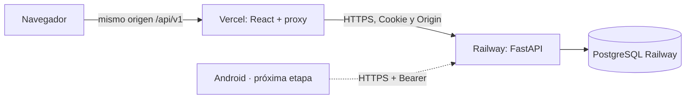

# Despliegue y mantenimiento

## Railway + Vercel

Este es el despliegue previsto para el proyecto. El repositorio contiene dos
servicios: Railway ejecuta FastAPI y Vercel compila `frontend/` con Vite.



### 1. Preparar Railway

1. Crea un proyecto Railway y agrega PostgreSQL.
2. Agrega un servicio desde este repositorio GitHub. Mantén **Root Directory
   en la raíz**, porque `requirements.txt` y `Dockerfile.backend` están allí.
3. Configura `RAILWAY_DOCKERFILE_PATH=Dockerfile.backend` antes de construir.
   Este Dockerfile solo instala y ejecuta FastAPI; no construye React.
4. Agrega variables:

   ```dotenv
   RAILWAY_DOCKERFILE_PATH=Dockerfile.backend
   DATABASE_URL=${{Postgres.DATABASE_URL}}
   APP_ENV=production
   COOKIE_SECURE=true
   SESSION_TTL_HOURS=24
   ALLOWED_ORIGINS=https://tu-dashboard.vercel.app
   ```

   Selecciona la referencia a `DATABASE_URL` del servicio PostgreSQL real. Si
   se llama distinto, adapta `Postgres`. El backend normaliza una URL
   `postgresql://` a `postgresql+psycopg://` automáticamente. No pegues esta
   contraseña en las variables frontend.

5. En Deploy, configura **Healthcheck Path** `/api/v1/health`. El CMD del
   Dockerfile escucha `PORT`, que Railway inyecta. Deja Start Command vacío
   para reutilizar ese CMD.
6. En la primera instalación, configura **Pre-deploy Command**:

   ```bash
   python -m backend.cli init
   ```

   Inicializa tablas y catálogo, sin administrador ni usuarios demo. Después
   puedes retirarlo; las versiones con cambios de esquema requerirán
   migraciones Alembic, no simplemente volver a ejecutar `create_all`.
7. Genera un dominio público del servicio, por ejemplo
   `https://tu-backend.up.railway.app`. Comprueba:

   ```text
   https://tu-backend.up.railway.app/api/v1/health
   https://tu-backend.up.railway.app/docs
   ```

   La raíz de Railway puede devolver 404: el frontend está en Vercel, y eso
   es correcto. Usa `/api/v1/health` para comprobar la API.

El builder y el puerto siguen las guías oficiales de
[Dockerfiles Railway](https://docs.railway.com/builds/dockerfiles) y
[healthchecks](https://docs.railway.com/deployments/healthchecks).
La guía usa Docker y Settings del servicio; no depende del antiguo
`railway.json`, que [Railway está sustituyendo por Infrastructure as Code](https://docs.railway.com/infrastructure-as-code#iac-vs-config-as-code).

### 2. Crear el administrador en Railway

Una vez desplegado, usa una consola dentro del contenedor. Con Railway CLI:

```bash
railway login
railway link
railway ssh --service campus-quest-api
```

Adapta el nombre del servicio. Dentro de la sesión remota:

```bash
python -m backend.cli create-admin --email admin@tu-universidad.edu
```

Introduce la contraseña cuando se solicite. Si omitiste el pre-deploy inicial,
ejecuta antes `python -m backend.cli init`. Crea el admin una sola vez. No
necesitas dejar `ADMIN_PASSWORD` en variables permanentes ni ejecutar
`seed-demo` en producción.

`railway run` ejecuta comandos **localmente** con variables del proyecto; una
URL privada PostgreSQL puede no resolver desde tu equipo. Para estos comandos
usa [railway ssh](https://docs.railway.com/cli/ssh), que se ejecuta en el servicio.
